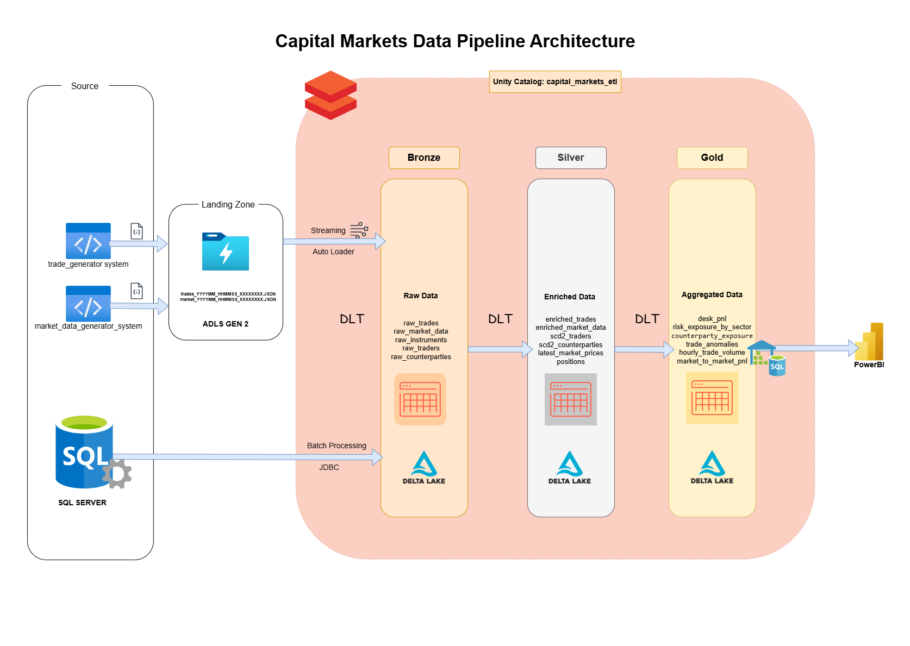
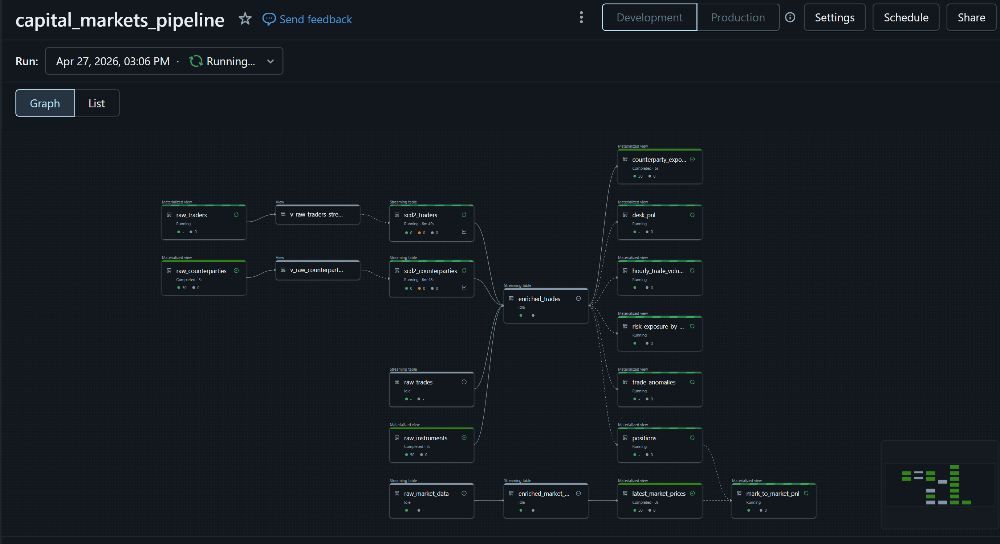
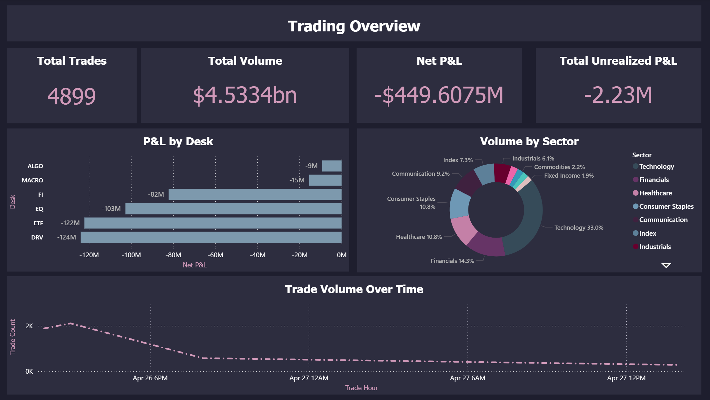
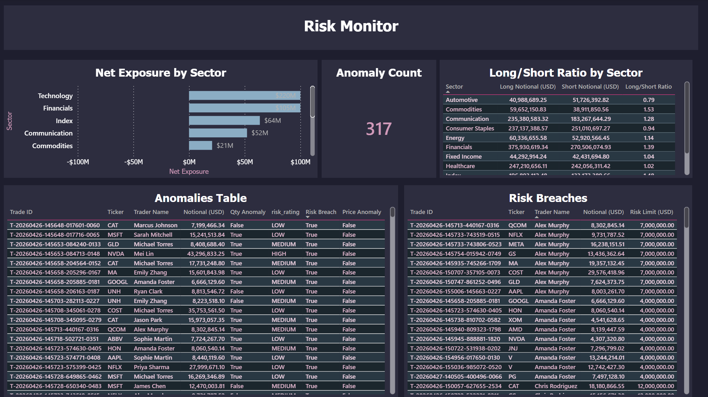
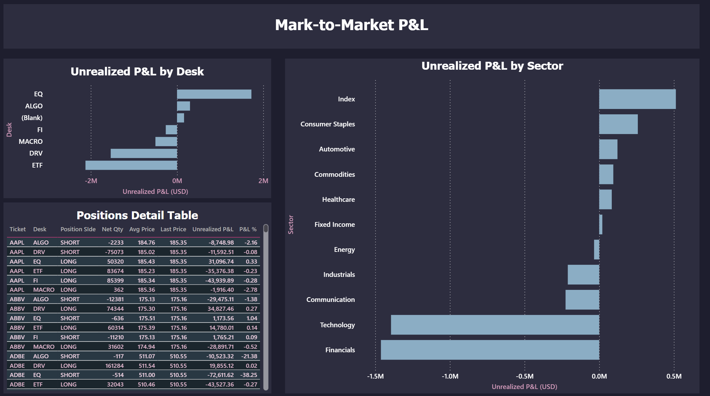

# Real-Time Capital Markets Trade Analytics & Risk Monitoring

An end-to-end streaming ETL pipeline on **Azure Databricks** that processes simulated trade executions and market data through a **Medallion Architecture** (Bronze → Silver → Gold) using Delta Live Tables, Unity Catalog, and Power BI.

---

## What It Does

- Ingests **streaming trades** and **market data** (JSON via Auto Loader) alongside **reference data** from Azure SQL DB (JDBC batch)
- Enforces **data quality** with DLT Expectations — drops bad records (null IDs, negative prices) and warns on soft violations
- Tracks **SCD Type 2** history for traders and counterparties using `dlt.apply_changes()`
- Produces **6 Gold-layer KPIs**: desk P&L, sector risk exposure, counterparty concentration, trade anomalies, hourly volume, and mark-to-market P&L
- Powers a **3-page Power BI dashboard** via DirectQuery for live monitoring

---

## Architecture

Trade executions and market data ticks are generated as JSON files and land in ADLS Gen2, where Auto Loader picks them up as a continuous stream. Reference data (instruments, traders, counterparties) is batch-loaded from Azure SQL DB via JDBC. A single DLT pipeline running in continuous mode on Serverless compute processes everything through three layers — Bronze (raw ingestion), Silver (enrichment, deduplication, SCD2, data quality enforcement), and Gold (aggregated KPIs like desk P&L, risk exposure, and anomaly detection). All tables are governed under Unity Catalog with managed storage on ADLS. A Databricks SQL Warehouse exposes the Gold layer to Power BI via DirectQuery for live dashboarding.



---

## Tech Stack

| Component | Technology |
|-----------|-----------|
| Cloud | Azure (Canada Central) |
| Lakehouse | Databricks Premium + Delta Lake |
| Pipeline | Delta Live Tables (DLT) |
| Governance | Unity Catalog |
| Ingestion | Structured Streaming + Auto Loader |
| Source DB | Azure SQL Database |
| Storage | ADLS Gen2 |
| CDC | `apply_changes()` — SCD Type 2 |
| Compute | DLT Continuous Mode (Serverless) |
| Visualization | Power BI (DirectQuery) |
| Language | Python / PySpark / SQL |

---

## Pipeline — 17 Delta Live Tables

| Layer | Tables |
|-------|--------|
| **Bronze** | `raw_trades`, `raw_market_data`, `raw_instruments`, `raw_traders`, `raw_counterparties` |
| **Silver** | `enriched_trades`, `enriched_market_data`, `scd2_traders`, `scd2_counterparties`, `latest_market_prices`, `positions` |
| **Gold** | `desk_pnl`, `risk_exposure_by_sector`, `counterparty_exposure`, `trade_anomalies`, `hourly_trade_volume`, `mark_to_market_pnl` |



---

## Dashboard

Three-page Power BI dashboard connected via DirectQuery to Databricks SQL Warehouse.

### Page 1 — Trading Overview
KPI cards (Total Trades, Volume, Net P&L, Unrealized P&L), P&L by Desk, Volume by Sector, Trade Volume over Time.



### Page 2 — Risk Monitor
Anomaly count, Net Exposure by Sector, Long/Short Ratio, Anomalies detail table, Risk Breaches.



### Page 3 — Mark-to-Market P&L
Unrealized P&L by Desk and Sector, Positions detail table with avg price vs. last price.



---

## Data Quality & SCD2

**DLT Expectations** enforce quality at the Silver layer:
- **Drop** — null `trade_id`, null `ticker`, `price ≤ 0`, `quantity ≤ 0`
- **Warn** — null `trader_id`, null `counterparty_id`, invalid timestamps

**SCD Type 2** via `dlt.apply_changes()` for `traders` (desk transfers) and `counterparties` (risk rating changes), with automatic `__start_at` / `__end_at` management.

The trade generator intentionally produces ~5% bad records to validate these rules.

---

## Credential Management

No credentials are hardcoded anywhere in the project. Secrets are managed at two levels depending on where the code runs:

**Databricks Notebooks (DLT pipeline)** — All Azure SQL and storage credentials are stored in a **Databricks Secrets** scope (`capital-markets`) and retrieved at runtime via `dbutils.secrets.get()`. The DLT notebooks construct JDBC URLs and ADLS paths from these secrets, so nothing sensitive appears in code, logs, or notebook output.

| Secret Key | Purpose |
|------------|---------|
| `storage-account` | ADLS Gen2 storage account name |
| `sql-host` | Azure SQL Server hostname |
| `sql-database` | Azure SQL Database name |
| `sql-username` | SQL admin username |
| `sql-password` | SQL admin password |

**Local generators (writing to ADLS)** — The `generate_to_adls.py` script runs locally and needs the ADLS storage account key. This is loaded from a `.env` file via `python-dotenv` and read through `os.environ`.

```
# .env
AZURE_STORAGE_KEY=your-storage-account-key
```

**Unity Catalog ↔ ADLS** — Authentication between Databricks and ADLS uses an **Azure Access Connector** with managed identity, assigned the Storage Blob Data Contributor role. No storage keys involved.

---

## Project Structure

```
capital-markets-streaming-etl/
├── data/
│   ├── seed/                        # instruments, traders, counterparties CSVs
|   ├── generators_output_sample/    # market_data and trades_data samples
│   └── generators/
│       ├── trade_generator.py       # Synthetic trade events
│       ├── market_data_generator.py # Synthetic market ticks
│       └── generate_to_adls.py      # ADLS writer (uses .env)
├── dlt_pipelines/
│   ├── 01_bronze_layer.py           # Auto Loader + JDBC ingestion
│   ├── 02_silver_layer.py           # Enrichment, SCD2, DQ expectations
│   └── 03_gold_layer.py             # Business KPIs & anomaly detection
├── docs/                            # Screenshots & architecture diagram
├── notebooks/
│   └── 00_setup_unity_catalog.py    # Catalog + schema setup
├── sql_setup/
│   ├── create_tables.sql            # Azure SQL DB DDL
│   └── load_seed_data.py            # Load CSVs into SQL DB
├── .env                             # ADLS storage key
└── requirements.txt

```

The generators require `azure-storage-blob` and `python-dotenv`. The seed data loader requires `pyodbc`. All DLT pipeline dependencies (PySpark, Delta Lake) are provided by the Databricks Runtime.

---

## Key Challenges Solved

| Challenge | Solution |
|-----------|----------|
| SCD2 in continuous mode breaks with `DELTA_SOURCE_TABLE_IGNORE_CHANGES` | Added intermediate DLT views with `skipChangeCommits=True` |
| Stream-static join race condition — enrichment columns all NULL on first run | Run initial Full Refresh in Triggered mode, then switch to Continuous |
| `input_file_name()` unsupported in Unity Catalog | Replaced with `_metadata.file_path` |
| Generator IDs duplicate on restart | Embedded full UTC timestamp + microseconds into trade/tick IDs |
| DAX calculated columns unsupported in DirectQuery | Used individual boolean anomaly flag columns instead |

---

## How to Run

1. **Provision Azure resources** via Azure Portal — Resource Group, ADLS Gen2, Azure SQL DB, Databricks workspace (Premium tier)
2. **Load seed data** — run `create_tables.sql` in SQL DB, then `load_seed_data.py`
3. **Configure Databricks** — create Access Connector, Storage Credential, External Location, Secrets scope, then run `00_setup_unity_catalog.py`
4. **Create DLT pipeline** — add the 3 DLT notebooks, set target catalog to `capital_markets_etl`, enable Serverless compute
5. **Generate data** — create `.env` with your storage key, then run `python generate_to_adls.py --duration 120`
6. **Start pipeline** — run in Continuous mode; Auto Loader picks up new files automatically
7. **Connect Power BI** — DirectQuery to SQL Warehouse, load Gold tables, build dashboard

---
